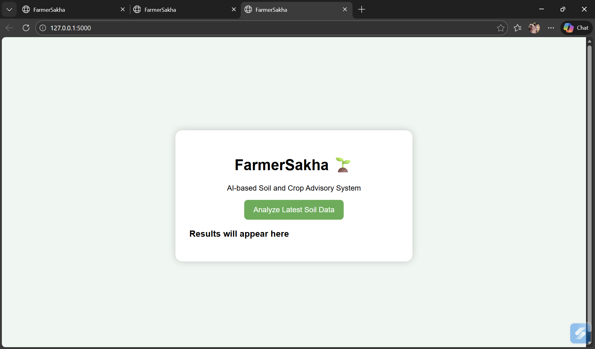
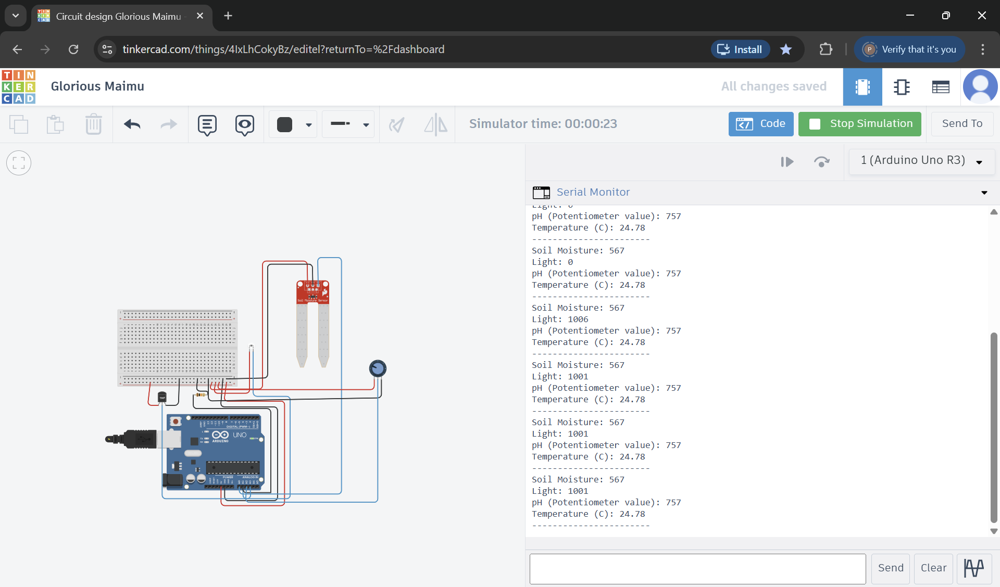

# FarmerSakha 🌱

An AI-inspired crop recommendation and soil advisory system designed to assist farmers in making data-driven agricultural decisions based on soil and climate parameters.

---

## 📌 Problem Statement

Farmers often rely on traditional methods or limited data when selecting crops. Incorrect crop selection and improper soil management can lead to reduced yield and increased input costs. FarmerSakha aims to provide a simple, accessible, and data-driven advisory system to support better farming decisions.

---

## 💡 Solution Overview

FarmerSakha analyzes soil and environmental parameters such as:

- pH
- Moisture content
- Temperature
- Light intensity
- Nutrient levels (NPK)

Based on these inputs, the system:

- Recommends suitable crops
- Calculates crop suitability scores
- Provides yield improvement advice
- Suggests cost-effective soil remedies

---

## ⚙️ Tech Stack

- **Frontend:** HTML, CSS, JavaScript  
- **Backend:** Python (Flask)  
- **Data Source:** Google Sheets (CSV), Agricultural Crop Dataset  
- **Simulation:** Tinkercad (for soil sensor prototype)

---

## 🔄 System Workflow

1. Soil and climate data are entered into Google Sheets (simulating sensor input).
2. The Flask backend reads the latest input values.
3. The system compares inputs with crop suitability dataset.
4. A scoring mechanism determines suitable crops.
5. Results are displayed on the web interface.

---

## 🖥️ Prototype Preview

### 🌐 Web Interface

### 🔧 Sensor Simulation (Tinkercad)

---

## 🚀 Key Features

- Multi-parameter soil analysis
- Crop suitability scoring
- Soil health summary
- Practical yield improvement suggestions
- Cost-effective remedies for soil issues
- Cloud-based input integration

---

## 🔍 Future Improvements

- Real-time IoT sensor integration
- Region-specific soil datasets
- Machine learning-based crop prediction
- Weather API integration
- Mobile-friendly deployment

---

## 📈 Impact

FarmerSakha promotes informed crop selection, sustainable soil management, and improved agricultural productivity through a simple and scalable web-based system.

---

## 👩‍💻 Author

Developed as a hackathon project focused on agricultural innovation and intelligent decision-support systems.
